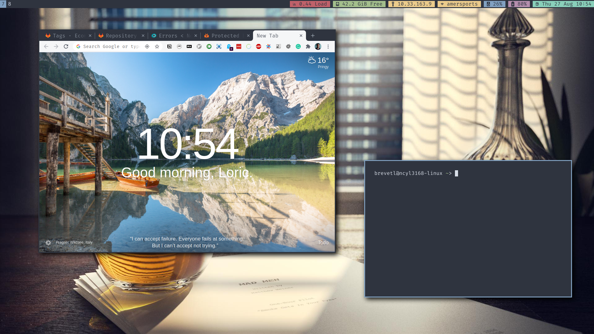

# nix-home

NixOS and Home Manager configurations and instructions.



## Table of contents

- Check [this page](docs/laptop.md) to know how to install NixOS on your laptop.
- Check [this page](docs/kimsufi.md) to know how to install NixOS on your Kimsufi server.
- Check [this page](docs/home-manager.md) for using home-manager to apply user configurations.

## Secrets

```
gopass show nix/secrets > secrets.nix
```

## Non NixOS setup

If you want to apply the user configurations without having NixOS as the operating system, you can also follow the [home-manager documentation](docs/home-manager.md).

Note that if you want to update your system, you should prefer the following command.

```
nix-channel --update; nix-env -iA nixpkgs.nix
```

### Xfce

If you are running Ubuntu, you should install Xfce.

```
# for oldest Ubuntu versions, use this PPA to have an up to date version.
sudo add-apt-repository ppa:xubuntu-dev/staging

sudo apt update
sudo apt install xfce4 xfce4-goodies
```

I also usually prefer using lightdm instead of gdm because it is simpler.

```
sudo apt-get install lightdm
sudo dpkg-reconfigure lightdm
```

#### Reset default properties

Home manager will make sure xfce properties are set as desired when applying the configurations. However, it will not delete any existing default ones. And they might sometimes collapse with the one I define. To avoid this problem, the first time you apply configurations, make sure to reset existing properties that could potentially interfere.

```
xfconf-query -c xfce4-keyboard-shortcuts --reset --recursive  --property "/commands/custom"
xfconf-query -c xfce4-keyboard-shortcuts --reset --recursive  --property "/xfwm4/custom"
xfconf-query -c xfce4-panel --reset --recursive  --property "/plugins"
```

#### Troubleshooting

There is a bug in Ubuntu 18.04 preventing from using the xpresent vblank mode of the compositor. Problem has been fixed but not yet backported to bionic. So manually install the `libxpresent1` package from `eoan`.

https://bugs.launchpad.net/ubuntu/+source/libxpresent/+bug/1801071

Then make sure you don't have any problems related to the window manager after login in `~/.xsession-errors`.
