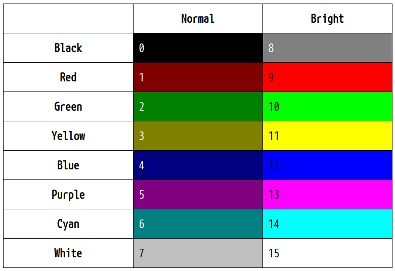

# nix-home

NixOS and Home Manager configurations and instructions.


## Table of contents

- Check [this page](docs/nixos-install.md) to know how to install NixOS with a ZFS filesystem.
- Check [this page](docs/home-manager.md) for using home-manager to apply user configurations.

## Non NixOS setup

If you want to apply the user configurations without having NixOS as the operating system, you will also have to follow the [home-manager documentation](docs/home-manager.md).

### i3

In the user configuration, i3 is launched using the `~/.xsession` user file. That means the display manager should have an option to run the default user session for this `~/.xsession` file to be taken into account. Here is an example of configuration to create a default user session entry. You need to create a file `/usr/share/xsessions/default.desktop` as follows.

```
[Desktop Entry]
Name=Xsession
Comment=This runs the default user session
Exec=default
Icon=
```

### Sway

Wayland does not have an external server (such as X) that should be started. Wayland is directly part of the Sway compositor. So we need to start Sway directly from the display manager.

So to use it, create a file `/usr/share/wayland-sessions/sway.desktop` as follows.

```
[Desktop Entry]
Name=Sway
Comment=This runs Sway vm
Exec=sway
Icon=
```

## Theming

Colors in terminal emulators were first standardized using some ANSI escape sequences. See https://en.wikipedia.org/wiki/ANSI_escape_code.

The original specification supported only 8 colors but terminal emulators rapidly started to support 16, 256 and even the complete range of colors (called "true colors"). However, most terminal utilities use only the main 16 colors defined as shown in the following table.



As I am also using graphical tools like i3, i3bar, rofi, urxvt and so on, theming is however a much broader scope than just the terminal palette. Colors should be consistent across the whole graphical environment. In order to achieve a successful theming, I like to restrict myself to only use 16 colors, staying close to the 16-terminal-colors concept defined in the above table. However, I don't want to be restricted to the named colors black, red, green, yellow, blue, magento, cyan and white. So here is the reference I will use instead.

| Normal        | Alt             |
| ------------- |-----------------|
| foreground    |                 |
| background    |                 |
| color dark    | color dark alt  |
| color 1       | color 1 alt     |
| color 2       | color 2 alt     |
| color 3       | color 3 alt     |
| color 4       | color 4 alt     |
| color 5       | color 5 alt     |
| color 6       | color 6 alt     |
| color light   | color light alt |

It is pretty much the same except that I have replaced the color names by numbers from 1 to 6, and I have added two specific colors called "dark" and "light".
The goal is to define the theme and then use these color names in all the configuration files instead of directly putting the color code.

### Implementation

All softwares have different configuration files and configuration formats. That's why it is difficult to establish a central global theme. In normal circumstances, that would require using something like a template preprocessor that would replace colors in each configuration file by colors defined in a global theme.

Using Nix and home-manager however makes it way easier. It will enable to have this theming behavior with a simple implementation.

I have decided to create a home-manager module to do so. This module defines the colors that are then referenced in all necessary configuration files using regular nix variables fetched from the theme module.

You can check the implementation in `home/gui/theme.nix`. It also references fonts and a special urgent color.

When building the theme, a `~/.theme.xresources` is generated in the Xresources format so it can be easily imported in tools like https://terminal.sexy/.
